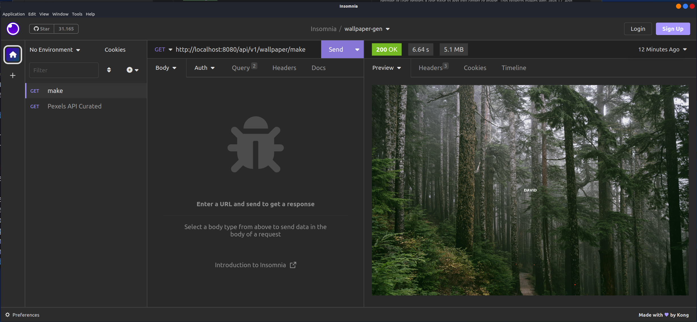

# wallpaper-gen

This project have the objective of generate wallpapers with a random image from thirdy party API's. And permit the user defines one frase to add into center of image. This projects makes with Java 17 and initial use the Pexel API.

## Tecnologies

- Java 17
- Spring Boot
- Pexel API
- Maven

## Request Collection

Into the folder /docs exists a file to Insomnia Collection.

## Project Topology

